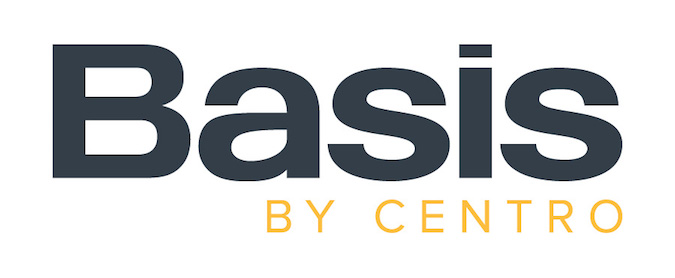

layout: true
class: middle, center

---

# Using Consul

### https://github.com/jrab89


???
Hi fellow Chicago DevOps enthusiasts!
My name is Jeff Rabovsky.
Today I'm here to talk to you about Consul.
Consul is an open source tool from HashiCorp.

---

background-image: url(hashicorp_stuff.png)

???
If your not familiar with HashiCorp, they're a company that builds a suite of fantastic open source tools.
Each tool is aimed at solving problems within a particular stage of the software development lifecycle.
Maybe you're familiar with or have worked with some of these, and if not that's ok.
I'm curious, just by show of hands, who has worked with some of HashiCorp's tools? Interesting.
I'll just give a high level overview of what each of these tools does just so everyone can get a sense of how this stuff all fits together.
Vagrant is the "V" on the left. It was the first of these tools, originally released in 2010.
And it's actually the only one written in Ruby. The rest are written in Go.
Vagrant is all about reproducable development environments. It allows you to express the details of what's in a development environments as Ruby code.
Vagrant then takes those details and then brings to fruition by interacting with a virtualization layer, usually Virtualbox.
Even if you're more of an operations person than a developer, Vagrant is still really useful for testing and building proof of concepts.
It's kind of like having the cloud on your laptop. It makes it really easy to bring up VMs and provision them with either shell scripts or configuration management.
The tool to the right of Vagrant, the one with this letter "P" logo, is Packer. Packer is for automating the creation of different types of machine images from a single source configuration.
The tool with the "N" logo is Nomad, which is an application scheduler. Nomad is similar to Kubernetes, if you're familiar with that.
Nomad is a lot more simple than Kubernetes though, both in terms of architecture and in the scope of features that it provides.
The tool below Nomad is Terraform. Terraform is kind of amazing! It allows you to describe what your cloud infrastructure should look like in code,
and it allows you to do that in a way that's composable and reusable. And it allows you to do this for basically every cloud provider.
The way it works is that you point it at the code that you've written, and it makes the API requests to your cloud provider in to get your infrastructure from its current state to the state described by your code.
Did I mention it works with every cloud provider? And it can show you what changes it would make before it actually carries out those changes. Yeah, Terraform's great, you should use it!
And then in the bottom left corner is Vault, which is for storing and managing secrets.
Vault is actually the only HashiCorp tool that I haven't worked with. So I don't really have any opinions on it.
That leaves us with this last tool on right, which is Consul. Conusl does a lot! And I'll get more into that in a bit.
One thing to clarify, the HashiCorp suite of tools work great together; there's integrations between pretty much all of them.
But they also all work great by themselves. So if you end up deciding after my talk that Consul is great and that you want to use it,
you don't neccessarily have to look use any of this other stuff. This was just for some background and to make it more clear how Consul and the other HashiCorp tools are different.

---

--



???
But before we get into Consul, first a little bit about myself.
I'm a senior engineer on the production operations team at Centro, a company here in Chicago.
We make Basis, which is a tool that helps advertisers plan, buy, and analyze their digital media campaigns.

--

.logos[
  
  
  
  
  
]

???
We use Ruby, Java, Python, JavaScript, and Amazon Web Services.
We're also looking at transitioning to more of a microservices architecture utilizing Kubernetes, in the very near future.
And like most companies that make software, we're hiring.
So if you happen to like any of these technologies and are looking for a job, maybe come talk to me afterwards.
(5.5 minutes)

---

???
First we'll take a step back, to get the bigger picture, so we can get a better idea of the types of scenarios in which Consul is useful.
Image it's the year 2005 and we want to build a movie application. A site where users and critics can rate movies and post reviews.

--

background-image: url(revenge_of_the_sith.jpg)

???
Lots of positive movie reviews happening on the internet in 2005 and we'd like to get a piece of that!
And since it was 2005 our architecture would've probably looked like this.

---

background-image: url(LAMP.png)

???
The cloud wasn't really available yet, so we probably would've had a single box with all of our software on it.
From an infrastructure perspective, this kind of setup is actually really easy. Everything can talk to everything else on localhost.
Everything has well defined ports. Apache is going to be listening on port 80. MySQL is going to be listening on port 3306.
And as long as you could keep that one box alive, things kind of just worked.
But I'm guessing that you all didn't come here to be told that your company's entire infrastructure should consist of Apache, PHP, and MySQL running on a single Linux box.
Or if you did that's fine too, who am I to judge?
So lets fast forward to what a more modern infrastruture might look like for our movies app.
We've had several Star Wars movies since 2005, some have been pretty good. Others have been not so good.

---

background-image: url(Solo.jpg)

???
Did the origin of Han's last name really need to get explained?
But it addition to Solo we also got virtualization and the cloud.

---

background-image: url(cloud_city.png)

???
And the cloud it turns out, is a really nice place to be.
You no longer have to buy expensive servers and networking equipment upfront. You get to pay for cloud infrastructure the same you pay for a utility, as you use it.
You also get to utilize managed services, for example in Amazon Web Services there's the Relational Database Service or RDS, which handles database backups and upgrades for you.
And most importantly is that your engineers don't have to worry about racking, stacking, cooling, and powering servers, and instead get to focus on making your customers happy.

---

background-image: url(services.png)

???
In 2019 a high-level view of our architecture might look like this. The comany has grown too. We probably have a few teams of engineers instead of just a few engineers.
You'll also notice that there's this box with the word "payments" on it, so we're probably making money selling movie tickets or something, so that's good.
In addition to "payments", we have 4 other vague boxes, each with a title that kind of aligns with other business domains,
and each has a team of engineers who are responsible for building and delivering each individual sub-component of our movies application.
This is what's refered to as a microservices architecture and it allows your different development teams to work independantly, and stay out of eachothers' ways for the most part.
For example, the team working on the auth service might decide to build their service with Ruby and to deploy weekly,
while the team building the Payments service might decide to use Java and to deploy quarterly.
And this is great because if there's a bug in the Reviews service then that team can patch and deploy their system without having to get the other teams inolved.
And you can imagine that as the company continues to sell more and more movie tickets hire more engineers,
new services would be built that would focus on more and more business domains in more granularity.
This is a great way to scale a software development organization, but unforunately there are no solutions in engineering, only tradeoffs.
What's involved in one of these vague boxes actually running in production? Let's zoom in and take a closer look at the Auth service.

---

background-image: url(auth_service.png)

???
We've got 8 VMs running a Rails app. And there's another 3 VMs running Redis, which are used to cache expensive database queries made by the app.
And then there's 3 VMs running Postgres, with one configured as a master and 2 configured as read-only slaves.
And remember, this is only the Auth service. There's likely dozens or possibly hundreds more VMs in our infrastructure, each running different software.
So in reality the 5 vague boxes I had shown you earlier actually get implemented like this.

---

background-image: url(ec2_instances.png)

???
Each of those little yellow squares is the logo for an EC2 instance.
And this is kind of the state of modern operations. We just keep having more and more stuff. There's more services. There's more layers of indirection.
There's more servers. AWS makes it really easy to launch servers, so if there's ever some problem that can be solved by launching a server,
you can bet that's what we're doing. There's also different ways that we persist data.
And, of course all this different stuff is intereconnected and needs to talk over the network.
This is starting to look a lot more complicated than PHP talking to MySQL on localhost.
So we have this new problem of finding our dependancies.
Well, it's not really a new problem, it just becomes more difficult to manage.
It's almost like our services need to some mechanism to discover eachother.

(12 minutes)

---

background-image: url(load_balancers.png)

???
One solution to this problem is to put load balancers in front of all of our services.
So if the reviews service needs to talk to the auth service, it doesn't talk directly to the VMs that are running the auth rails app.
Instead, it talks to the load balancer that fronts the auth service, and then the load balancer forwards that request to one of the auth VMs.
This way, clients of the auth services don't need to concern themselves with the IPs of the VMs that are running the auth service rails app.
They just need to know the IP of the load balancer that's in front of the auth service, and then the load balancer worries about which actual VM the request goes to.
Clients of the auth service still need to know that IP though, it has to go somewhere. So might hard-code this, or it would probably be better to have it be configurable.
And this actually works reasonably well. But there are a few drawbacks to this approach. The first is now we have this proliferation of load balancers.
If you're on Amazon Web Services you could use Elastic Load Balancers here, and each of those is going to be $20 a month. It's not a huge cost, but it's not free either.
And $20 per month is probably on the low end. If your organization uses another type of load balancer, this could be a lot more expensive.
The second problem is that we've introduced single points of failure all over our infrastructure. Even though we're running multiple instances of the auth application,
clients only know about the load balancer. So if there's a problem with the load balancer in front of the auth service, it doesn't matter than we're running 8 copies of the rails app,
the whole service is effectively offline. The third problem is that clients of the auth service no longer get to talk to it directly. They have to go through this middleman.
We've effectively doubled the network latency here. This might not be a big problem for our application, but for some very latency sensitive applications it could be an issue.
Something else to be mindful of is that load balancers tend to be manually managed. Maybe during a deployment the wrong VM behind the load balancer is removed. That could be bad.
(14.5 minutes)

---

background-image: url(consul_arch.png)

???
A better solution would be to use Consul's service discovery capabilities.
The way this works is that every node in our infrastructure is going to run the Consul agent.
Consul agents get started as either a server, or as a client.
Consul agents ran in client mode are very lightweight and forward all requests to a server. The client is relatively stateless. It will do some caching.
Consul clients also take part in the cluster gossip pool. This has a minimal resource overhead and consumes only a small amount of network bandwidth.
The purpose of the gossip pool is to quickly propogate information across the cluster. For example when nodes join, leave, or fail, the gossip protocol detects this, and lets the other nodes across the cluster know.
I won't get to deep into the gossip protocol, or the RAFT protocol that the servers partake in, there's a lot more on these in the Consul documentation.
For now it's enough to know that Consul's gossip protocol involves random node-to-node communication, primarily over UDP.
Consul servers are agents with an expanded set of responsibilites. They do most of the heavy lifting and it's their job to respond to queries that get forwarded to them and to maintain cluster state.
A typical Consul cluster will have 3 or 5 servers per datacenter or cloud region.

---

background-image: url(service_discovery.png)

???
Now that we understand the difference between Consul clients and servers we can get into how service discovery in Consul works.
We've got that same auth service that consists of 8 VMs running a Rails app. But now that we're using Consul, these VMs are also running a Consul client.
When a Consul agent on one of these 8 VMs starts up, it will read it's configuration file on disk, and see that it's a Consul client, and not a server.
The client's configuration also needs to tell it where the Consul servers are, so that it can join the cluster. There's a few different ways you can do this.
The most simple way is to have a list of static Consul server IPs in your agent's configuration. Another way for the Consul client to find servers is use the cloud auto-joining feature.
This was added in Consul 0.9.1 and allows Consul agents to locate servers based on cloud metadata. So if you were running Consul in AWS you'd specify an EC2 tag that your Consul servers have,
and the client would then query AWS for EC2 instance IPs with those tags and use to join the cluster. I like this approach since it gets rid of the need to hardcode IPs and makes the IPs of your Consul servers un-important.
If you've ever worked with Apache Cassandra, this is very similar to the EC2 snitch. But either way, if we used static IPs or the cloud auto-joining feature,
now the client knows where to find a server, and it can join the cluster. Once the client on one of our Rails VMs has joined the cluster, it then needs to inform the cluster of services that are running on that particular VM.
The way that this happens is again through configuration of the client. Once it joins the cluster, it reads service files from its configuration directory and registers those so the rest of cluster knows about them.
From there, any clients of our auth service can query Consul for the address of VMs running the auth service, so that they can make requests to it.
That might have been a lot, so I'll recap, we've got the Consul agent running everywhere. It's running in server mode on these machines and in client mode everywhere else.
When the clients starts up on the same machines as our rails app they first join the cluster. They then register and inform the rest of the cluster of the auth service that they are running.
Then, when a client wants to make a request to the auth service, instead of going through a load balancer, it queries the cluster, asking "hey, where can I find an instance of the auth service?"
The cluster replies with an IP of one the machines over here, and then the client can then make a request directly to that IP. And that's how all of our internal communication works.
We're not going to put things behind load balancers, instead we're going to have Consul tell us where things are.
(20 minutes)

---


```
#!/bin/bash -eux

VERSION="$1"

yum install epel-release -y
yum install unzip tree nc lsof vim jq bind-utils dnsmasq -y
curl "https://releases.hashicorp.com/.../${VERSION}_linux_amd64.zip" \
     -o /tmp/consul.zip
unzip /tmp/consul.zip -d /tmp
mv /tmp/consul /usr/local/bin

mkdir /etc/consul.d

cp /vagrant/config/consul.service /etc/systemd/system
systemctl enable consul
```

???
So I mentioned we've got Consul servers, clients, and various configuration files for those. That might sound kind of scary, but it's not that bad.
HashiCorp does a great job making their tools very usable with minimal configuration. They do also do a great job with documentation.
And this is how easy it is to install Consul. It's so easy that I can take an actual script I use when I'm testing Consul, and I can fit that script on 1 slide.
This is taking a parameter for the version of Consul to install. It's installing some packages. Then it's downloading a precompiled binary of Consul for my
platform from HashiCorp. I mentioned earlier that most of HashiCorp's tools are written in Go. And go makes compiling self-contained binaries really easy.
And as an operations person, I really like working with self-contained binaries. Anyways, we extract that binary, move it to /usr/local/bin, make a configuration directory,
we copy over a Systemd unit file, and then we enable the service. And by the way, Consul uses the same binary for both the client and server agent,
that means if we were going to use this script or something similar to it, maybe configuration management, that installing Consul on clients and servers is the exact same.
That's what installing Consul looks like. How about configuration?

---

```
$ cat /etc/consul.d/server_config.json
{
  "server": true,
  "acl_master_token": "2C483053-76D0-4AC8-974F-E24F12C07AC3",
  "bootstrap_expect": 3,
  "client_addr": "0.0.0.0",
  "data_dir": "/var/consul",
  "retry_join": [
    "10.120.0.0",
    "10.120.0.1",
    "10.120.0.2"
  ]
}
```

???
This is what configuration for a Consul server looks like. It's JSON and it's not that scary. First there's the "server" option that's set to "true", this tells the agent to start in server mode.
Then theres the "acl_master_token" option, here you need to provide a UUID which will get used as an access token with permissions to do anything. This is useful for bootstraping Consul's ACL system,
if you decide to do that. By default, the Consul ACL's system is off, this means that anyone with access to any of your Consul clients or servers can do anything in your cluster.
This might be ok for some organizations, but in some organizations this could be a big problem. If you do decide to use Consul, I recommend that you plan how you're going to use Consul's ACL system.
This is because Consul is the type of system that tends to gets used everywhere in your infrastructure by everything. And there's different ways to interact with it, some of which we'll get into.
What I'm getting at is that it's much harder to get an existing Consul infrastructure using the ACL system than using it from the beginning. And this is coming from experience.
At Centro, I've been working on getting us using the ACL system for the last 3 months. The "bootstrap_expect" option with a value of 3 means that our cluster expects to have 3 Consul servers.
"client_addr" is the network interfaces that Consul's HTTP and DNS servers will listen on. This defaults to the loopback interface, which is probably what you want for Consul clients,
but not for your Consul servers. "data_dir" is where the Consul agent will store its state on disk. And finally "retry_join" is where you specify the IP addresses of Consul servers to join when starting up.
If this Consul cluster were on a cloud provider and was using the cloud auto-joining feature, this option would look different.

---

```
$ cat /etc/consul.d/client_config.json
{
  "server": false,
  "data_dir": "/var/consul",
  "retry_join": [
    "10.120.0.0",
    "10.120.0.1",
    "10.120.0.2"
  ]
}
```

???
That was server configuration, here's what client configuration looks like. It's the same, but with a few things removed. The server option is also set to "false".
The server configuration and client configuration is all we really need to run a cluster. But the cluster isn't doing anything useful yet.
We need to tell it about services that we have. And this is also done with configuration files.

---

```
$ cat /etc/consul.d/auth_service.json
{
  "service": {
    "name": "auth",
    "port": 3000,
    "check": {
      "http": "http://localhost:3000/health",
      "interval": "10s",
      "timeout": "2s"
    }
  }
}
```

???
This file is also in /etc/consul.d, so it will also get loaded by the client when it starts. The client also takes care of registering this service if it hasn't been registered yet by another client.
This service definition contains some basic metadata about the auth service. There's a name, which clients will use to query Consul in order to find where this service actually is.
You can also specify the port that your sevice listens on here, so that the address and port of your service can be discovered by clients.
Services can also have health checks associated with them. This is a powerful feature that Consul to gracefully remove failing nodes from it's service catalog.
For example, if one of rails instances maybe runs out of memory or disk, we don't want clients to try to make requests to that instance. We'd prefer they go to a different node.
Here I'm using Conul's built in HTTP check. This will make an HTTP GET request to the /health endpoint every 10 seconds. If there's ever a non-200 response code or a request that takes longer than 2 seconds,
then the auth service running on that particular machine will be considered unhealthy, and clients asking Consul for an service won't see that IP.
There's other types of checks you can use too, including a script check. You provide a script check with your own script that can do anything, and if that script exits zero, then Consul considers your service healthy.
I haven't worked with Nagios much, but my understanding is that this is very similar to the way that works. So if you have some scripts for that ecosystem, you might be able to reuse those here.

---

```
$ dig +short @127.0.0.1 -p 8600 auth.service.consul.
10.110.0.0
10.110.0.1
...
$ curl http://localhost:8500/v1/catalog/service/auth
[
  {
    "Node": "10.110.0.0.us-west-2.compute.internal",
    "Address": "10.110.0.0",
    "ServiceName" "auth",
    "ServicePort": 3000,
    ...
  },
...
]
```

???
Now that our machines that are running the auth rails app are registering that service with Consul, how do the clients of the auth service ask Consul where that is?
Consul does this in 2 ways. The first is through DNS. Consul agents run a DNS server that allows you to construct different DNS queries to get different information out of Consul.
In this basic example we're doing a service lookup. The client asks for a service and then Consul responds with a list of healthy IP addresses for that service.
The responses get shuffled too so that load gets balanced accross the different machines that make up a service. The DNS interface is also really legacy friendly.
Everything knows how to talk to DNS. So if you have an application that you can't change, but still want to be able to do service discovery, Consul is a great way to make that happen.
In this example I'm querying the Consul DNS server directly, but in a real-world use case you'd probably configure your DNS to forward the appropriate queries to Consul.
At Centro we use dnsmasq to do this. dnsmasq is really easy to work with. There's also the HTTP API that gives you some more metadata. But in most cases the DNS interface is 90% of what you want.
So that's how Consul does service discovery. But you're still probably wondering:

---

background-image: url(ec2_instances.png)

???
How does Consul help me configure my applications here? The answer is that Consul also provides a key-value store.

---

```
$ curl -X PUT -d 'DEBUG' http://localhost:8500/v1/kv/auth/log_level
true
$ curl 'http://localhost:8500/v1/kv/auth/log_level?raw=true'
DEBUG
```

???
Consul provides a very simple HTTP interface for this. To write you give it a key and a value. And to read you give it a key and it gives you the value.
This storage is also highly available. Your writes gets replicated to all of the Consul servers in your cluster.
This approach to configuration is nice too since it lets developers turn knobs without needing to get involved with big configuration management systems.
It's pretty common for organizations to use configuration management systems for this kind of thing, but it's rare that they let developers change configuration in there.
And I think in a lot of cases you do want developers to be able to change configuration settings, especially when they're on call.
This approach to configuration lets you turn knobs much more quickly too. When you change something in Consul's key-value store, your app is going to see that immediately.
On the other hand, configuration management systems usually get ran on schedule, maybe once every 10 minutes. And if you're in a situation where something is broken,
you don't want to be waiting 10 minutes for your configuration management system to run.

---

## https://github.com/hashicorp/envconsul
## https://github.com/hashicorp/consul-template

???
And Consul has some good options for making the key-value store work with legacy applications too. envconsul reads from a namespace or specific keys in consul that you specify and exposes those to your application as environment variables.
consul-template is similar, but it renders configuration files based on templates that you provide and values in Consul.
Both envconsul and consul-template also have the ability to gracefully restart your application when your configuration changes, if you decide that's something that makes sense for your application.
And since everything uses either files or environment variables for configuration, you can use envconsul and/or consul-template to configure anything.

---

## Distributed Locks

???
Another difficult problem that Consul can be helpful with when our systems become more distributed is leader election. Leader election is the problem of determining a single process as special among many peers.
An example of when we might need this is with our payments service. The payments service interacts with some 3rd party payments system, but we need to be careful about multiple machines that make up our payments system from making requests to the 3rd party API at the same time.
A way to deal with this is to have 1 of our payments service machines get designated as the leader, and then only that machine interacts with the 3rd party payments service. So how does leader election actually happen?
First, all of the payments machines are unaware of which machine is the leader. Then, we run our leader election algorithm, and then each machine recognizes a distinct machine as the leader.
How do we go about building such as algorithm? It turns out its really hard, especially taking into account the possibilty of network or machine failures during or after the leader election process.
Fortunately, we don't need to worry about the details of such an algorithm because Consul has some really nice primatives that we can build ontop of.

---

### machine 1
```bash
$ consul lock locks/payments ruby work.rb
started doing work at 2019-02-26 22:19:49 +0000
finished           at 2019-02-26 22:19:59 +0000
```

### machine 2
```bash
$ consul lock locks/payments ruby work.rb
started doing work at 2019-02-26 22:19:59 +0000
finished           at 2019-02-26 22:20:09 +0000
```

???
The simplist way to do this is to use the "consul lock" command.
A lock is created at a given key in the key-value store, and only when held, is a child process invoked. If the lock is lost or communication is disrupted, the child process is terminated.
The number of lock holders is configurable with the "-n" flag. By default, a single holder is allowed. But you can allow for more than one process to hold the lock, which is what a semaphore is.

---

### https://www.consul.io/docs/guides/leader-election.html

???
"consul lock" is implemented by the leader election algorithm and uses the session and key-value store HTTP APIs.
So if you want to use Consul's locking capabilites, take a look at this guide.

---

# Thanks!